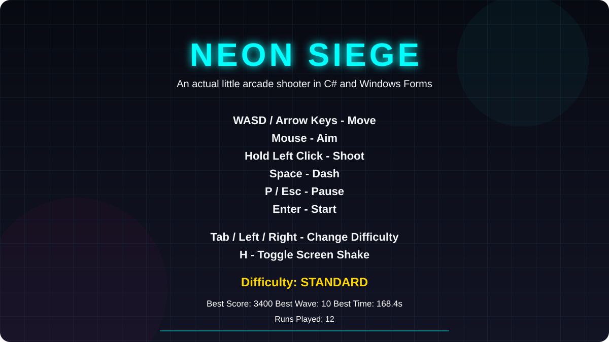
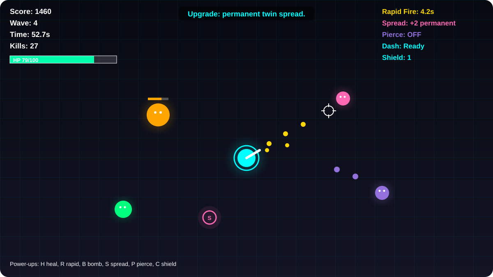
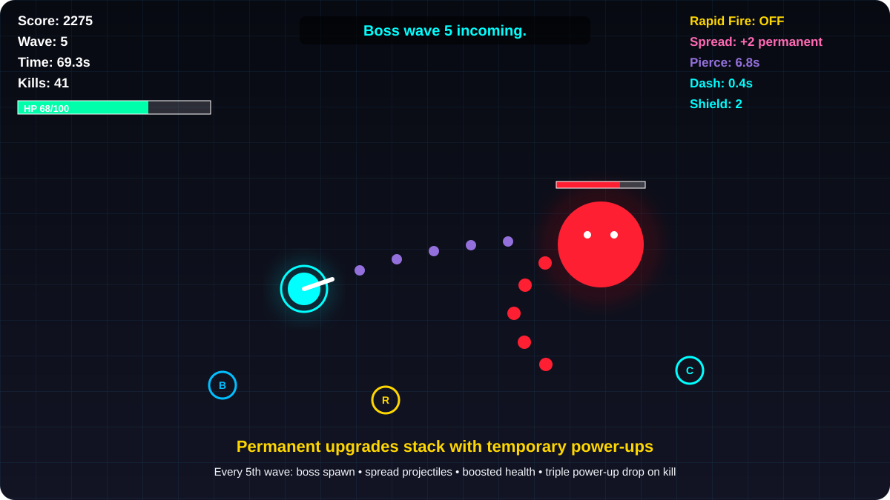
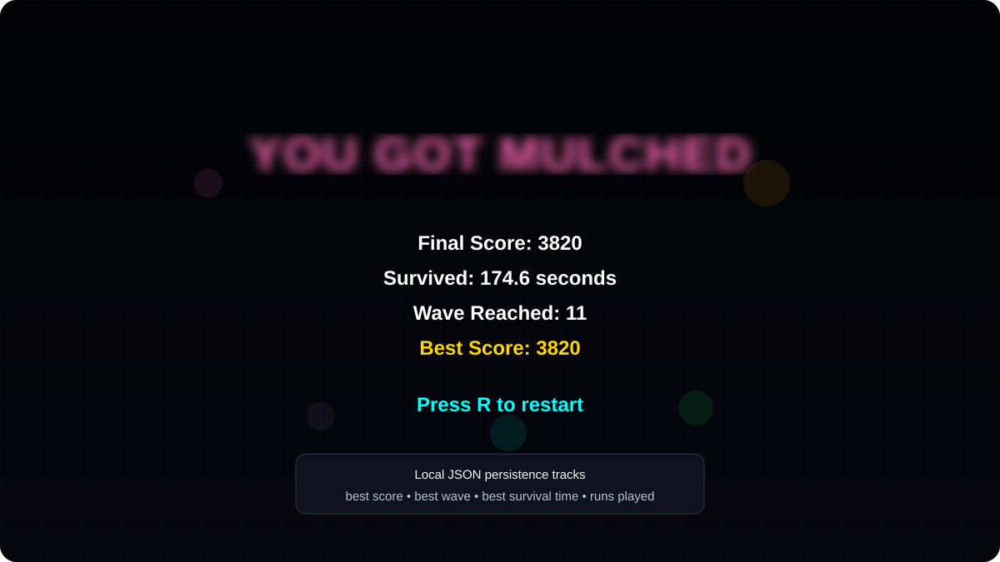

# Neon Siege

**A neon-styled C# arcade survival shooter built from scratch with .NET 8, Windows Forms, GDI+ rendering, custom collision logic, enemy AI, wave progression, power-ups, and local high-score persistence.**

Neon Siege is a compact desktop action game built without a game engine. The entire gameplay loop lives in a native Windows Forms application: movement, mouse aiming, shooting, enemy behaviors, boss waves, collisions, permanent weapon progression, temporary power-ups, visual effects, HUD rendering, pause/game-over states, and JSON-based run records.

The result is a deliberately small but complete arcade loop built around one idea: **survive as the arena becomes faster, denser, and increasingly rude.**

> **Platform:** Windows desktop (`net8.0-windows`). Neon Siege is a native WinForms game, so there is no browser-hosted live demo.

## Game preview

<p align="center">
  
  &nbsp;
  
</p>

<p align="center">
  <strong>Title screen</strong>: controls, difficulty selection, screen-shake toggle, and persisted run records.<br/>
  <strong>Live arena</strong>: mouse aiming, enemy pressure, weapon state, health, score, wave, kills, and power-up HUD.
</p>

<p align="center">
  
  &nbsp;
  
</p>

<p align="center">
  <strong>Boss waves</strong>: spread-fire bosses, permanent upgrades, temporary modifiers, and escalating wave pressure.<br/>
  <strong>Run persistence</strong>: final score, survival time, wave reached, best score, and restart flow.
</p>

> The portfolio previews above are source-faithful visualizations based directly on the current WinForms/GDI+ rendering code, labels, HUD layout, entity colours, controls, and game states. They are documentation previews rather than captured screenshots from a Windows desktop session.

## Project at a glance

| Area | Implementation |
| --- | --- |
| Language | C# |
| Runtime | .NET 8 |
| Desktop UI | Windows Forms |
| Rendering | Custom GDI+ / `System.Drawing` drawing |
| Game loop | ~60 FPS `System.Windows.Forms.Timer` update loop |
| Input | Keyboard movement + mouse aim/fire |
| Physics | Custom vector movement and circle collision detection |
| Persistence | Local JSON high-score file |
| Audio feedback | Windows `SystemSounds` |
| Game engine | None |

## Core gameplay loop

```text
Start Run
   |
   v
Move + Aim + Fire
   |
   v
Survive Enemy Spawns
   |
   +----> Collect Temporary Power-Ups
   |
   +----> Reach Score Upgrade Thresholds
   |
   v
Wave Advances Every 16 Seconds
   |
   +----> Every 5th Wave: Boss
   |
   v
Difficulty Continues Scaling
   |
   v
Player Health Reaches 0
   |
   v
Save Run Records -> Game Over -> Restart
```

The game continuously increases enemy pressure while rewarding score milestones with permanent weapon improvements. Temporary drops layer on top of that progression, allowing a run to shift from basic single-shot survival into rapid-fire, piercing, multi-projectile chaos.

## Controls

| Input | Action |
| --- | --- |
| `WASD` / Arrow Keys | Move |
| Mouse | Aim |
| Hold Left Click | Fire |
| `Space` | Dash |
| `P` / `Esc` | Pause / resume |
| `Enter` | Start from title screen |
| `R` | Restart after death or from pause |
| `Tab` / Left / Right | Cycle difficulty on title screen |
| `H` | Toggle screen shake |

### Dash behavior

Dash is not just a movement burst. It provides a short invulnerability window, generates cyan particles, triggers screen feedback, and respects a cooldown before it can be used again.

If no movement direction is being held, the dash direction falls back to the current mouse aim vector.

## Enemy system

Neon Siege uses five enemy types with different stats and behaviors.

| Enemy | Behavior |
| --- | --- |
| **Chaser** | Fast baseline enemy that moves directly toward the player |
| **Brute** | Larger, slower, higher-health contact enemy with a visible health bar |
| **Shooter** | Tries to maintain range and fires projectiles at the player |
| **Splitter** | Mobile enemy that creates two accelerated Chasers when destroyed |
| **Boss** | Large high-health enemy with contact damage, health bar, and five-projectile spread attacks |

Enemy types are introduced progressively as the wave count rises rather than appearing all at once.

### Boss waves

A new wave begins every **16 seconds**. Every fifth wave spawns a Boss in addition to the normal enemy pressure.

Bosses:

- Scale health with the current wave
- Inherit difficulty-based health, speed, and damage modifiers
- Fire a five-shot spread attack
- Cause heavier screen shake
- Award a large score bonus
- Drop three power-ups when defeated

## Permanent score progression

Weapon progression is tied directly to run score. Reaching each milestone permanently upgrades the player for the rest of that run.

| Score | Upgrade |
| ---: | --- |
| **250** | Overcharged rounds: increased bullet damage |
| **700** | Faster firing |
| **1,300** | Permanent twin spread |
| **2,200** | Piercing rounds unlocked |
| **3,400** | Meltdown mode: additional damage + faster fire rate |

The system uses upgrade tiers rather than repeatedly applying the same threshold, so each milestone is awarded once per run.

## Temporary power-ups

Normal enemies have a chance to drop a random power-up. Bosses drop three.

| Power-up | Effect |
| --- | --- |
| **Heal** | Restores up to 30 health |
| **Rapid Fire** | Temporarily halves firing cooldown |
| **Bomb** | Destroys all non-boss enemies and awards bonus score |
| **Spread Shot** | Temporarily adds extra projectiles |
| **Pierce Shot** | Allows bullets to continue through an additional enemy |
| **Shield** | Absorbs an enemy collision and can stack up to three hits |

Each power-up uses its own colour and single-letter arena marker, with matching HUD/state feedback.

## Difficulty modes

The title screen supports three difficulty levels.

| Difficulty | Player | Enemy pressure |
| --- | --- | --- |
| **Rookie** | 120 HP, higher movement speed | Lower enemy health, speed, damage, and slightly slower spawning |
| **Standard** | 100 HP, baseline speed | Baseline scaling |
| **Overdrive** | 90 HP | Higher enemy health, speed, damage, and faster spawning |

Difficulty modifies more than player health. Spawn cadence and enemy stat multipliers change as well, so Overdrive actually alters combat pressure rather than merely changing a label in the corner.

## Game-state architecture

The application uses an explicit screen-state model:

```text
Title
  |
  v
Playing <----> Paused
  |
  v
Game Over
  |
  +---- R ----> Playing
```

`GameForm` owns the main loop and orchestrates input, simulation, collision handling, spawning, progression, persistence, and rendering.

The supporting entity types keep state for:

```text
Player
Enemy
Bullet
EnemyBullet
Particle
PowerUp
HighScoreData
```

Enums define the major runtime categories:

```text
ScreenState
Difficulty
EnemyKind
PowerUpKind
```

## Update loop

The WinForms timer runs at a nominal interval of **16 ms**, with gameplay updates using a fixed `1 / 60f` timestep.

During an active run the update path is roughly:

```text
Update timers
   |
Apply score upgrades
   |
Advance wave / spawn boss if required
   |
Read player movement
   |
Handle firing
   |
Spawn enemies
   |
Update player bullets
Update enemy bullets
Update enemies
Update particles
Update power-ups
   |
Resolve collisions
   |
Check player health
```

This keeps simulation logic separate from `OnPaint`, where the current state is drawn.

## Collision system

Neon Siege uses lightweight circular collision checks based on squared vector distance.

Collision handling covers:

- Player bullets vs. enemies
- Enemy projectiles vs. player
- Enemy contact vs. player
- Shield interception
- Player vs. collectible power-ups
- Piercing projectile continuation

Using squared distance avoids an unnecessary square root for each collision comparison.

## Rendering and effects

The game is rendered entirely through Windows Forms / GDI+.

### Arena

The playfield is a fixed **1000 x 700** window with:

- Dark vertical background gradient
- Cyan grid overlay
- Custom crosshair
- Neon entity colours
- Player/enemy glow layers
- Boss and Brute health bars
- HUD panels and notifications

### Combat feedback

Visual feedback includes:

- Muzzle particles
- Hit particles
- Death bursts
- Power-up bursts
- Screen shake
- Player damage flash
- Dash particles
- Invulnerability blinking
- Shield ring
- Enemy-specific colours

The player is cyan, while enemy categories use distinct colours such as hot pink, orange, purple, spring green, and red for the Boss.

## HUD

The runtime HUD tracks:

```text
Score
Wave
Survival time
Kills
Health
Rapid Fire state
Spread state
Pierce state
Dash cooldown
Shield hits
Power-up legend
Notifications
```

The HUD therefore doubles as both status display and explanation of the current run build.

## High-score persistence

At the end of a run the game updates and stores:

- Best score
- Best survival time
- Best wave reached
- Total runs played

The data is serialized with `System.Text.Json` to:

```text
neon_siege_highscore.json
```

Loading and saving are guarded so a missing or invalid save file does not prevent the game from starting.

## Run locally

### Requirements

- Windows
- .NET 8 SDK
- VS Code, Visual Studio, or another .NET-capable editor

Clone the repository:

```bash
git clone https://github.com/Kyla-Zeit/neon-siege.git
cd neon-siege
```

Restore dependencies:

```bash
dotnet restore
```

Run the game:

```bash
dotnet run
```

## Build

Create a release build with:

```bash
dotnet build -c Release
```

The project targets:

```text
net8.0-windows
```

with Windows Forms enabled and a Windows executable output type.

## Project structure

```text
neon-siege/
├── docs/
│   └── assets/                 # README portfolio previews
├── .vscode/
├── Entities.cs                 # Player, enemies, bullets, particles, power-ups, save model
├── GameForm.cs                 # Game loop, input, AI, spawning, collisions, progression, rendering
├── Program.cs                  # Application entry point
├── NeonSiege.csproj            # .NET 8 Windows Forms project
├── NeonSiege.sln
└── README.md
```

## What this project demonstrates

Neon Siege is intentionally small, but it covers a surprisingly broad slice of game/application engineering without relying on a game engine:

- Real-time update loops
- Keyboard and mouse input
- Vector movement
- Enemy AI variants
- Difficulty scaling
- Spawn scheduling
- Boss encounters
- Projectile systems
- Collision detection
- Temporary and permanent progression systems
- Stateful HUD rendering
- Particle/effect systems
- Pause and game-over state management
- Local JSON persistence
- Native Windows desktop development

## Current scope

Neon Siege is a portfolio-scale arcade game rather than a commercial release. It currently uses generated GDI+ shapes instead of sprite assets, Windows system sounds rather than a full audio pipeline, a single arena, and one persistent best-run record rather than a full leaderboard.

Potential future extensions include dedicated audio assets, additional bosses and arenas, weapon selection, a local top-10 leaderboard, richer visual assets, controller support, and a packaged executable release.